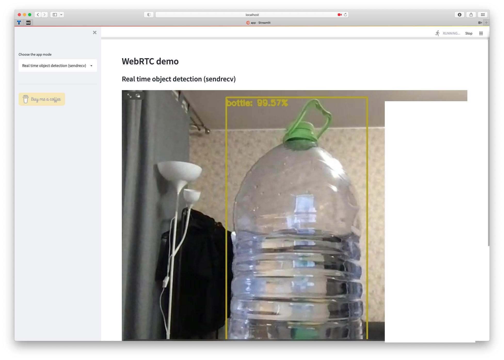
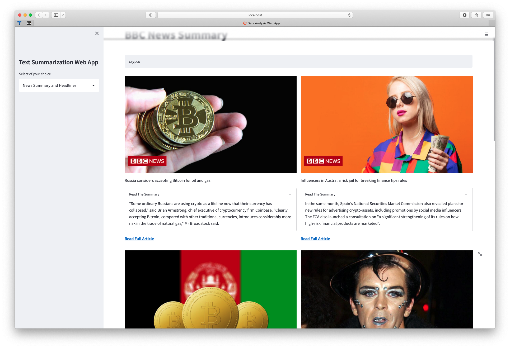
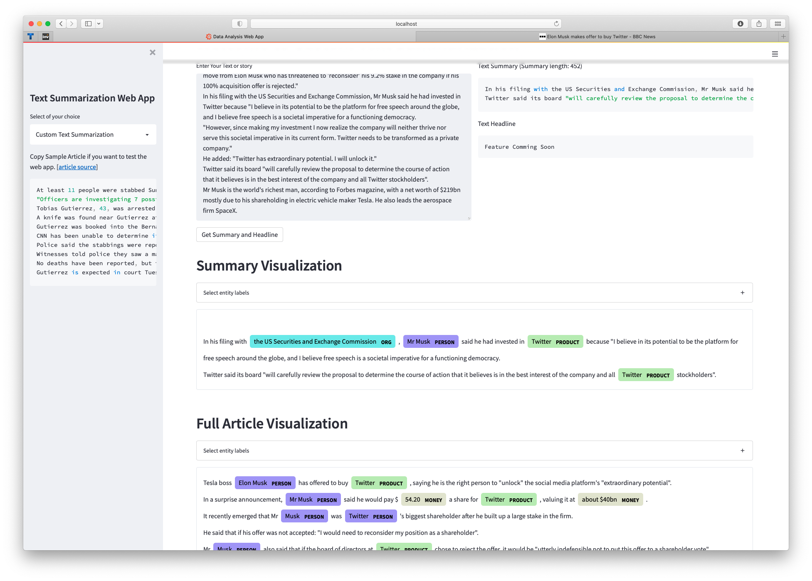
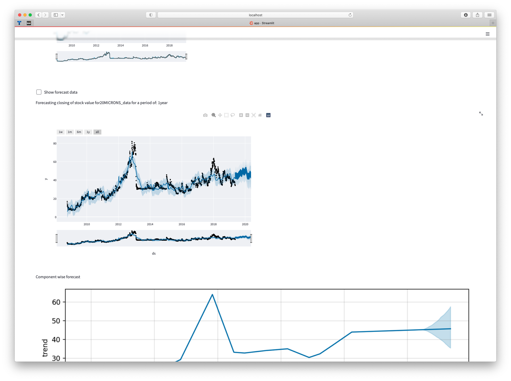
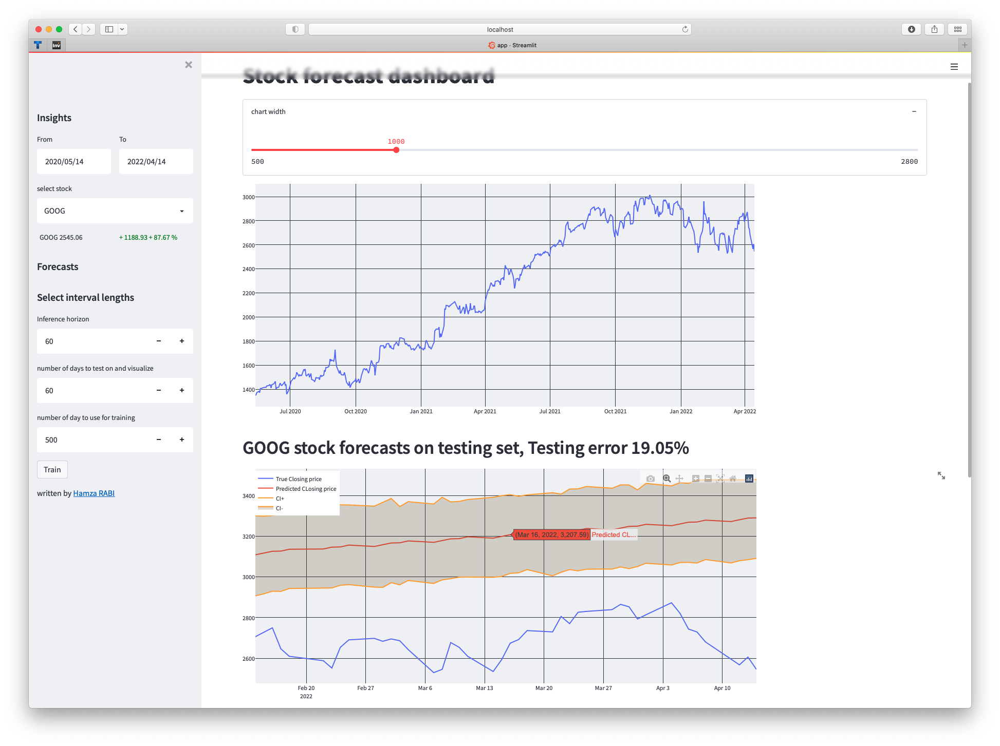

# EfficientDLStreamlitDemo

All projects could start with `streamlit run app.py`

Requirements that suits for all project at once, u can find here `all_projects_requirements.txt`

1. Webrtc-example 

2. Text-Summarization

|   |     |
|----| ---- |
|  |  |

4. TimeseriesForcastOne 

5. TimeseriesForecastTwo  

* Utacdeploy_