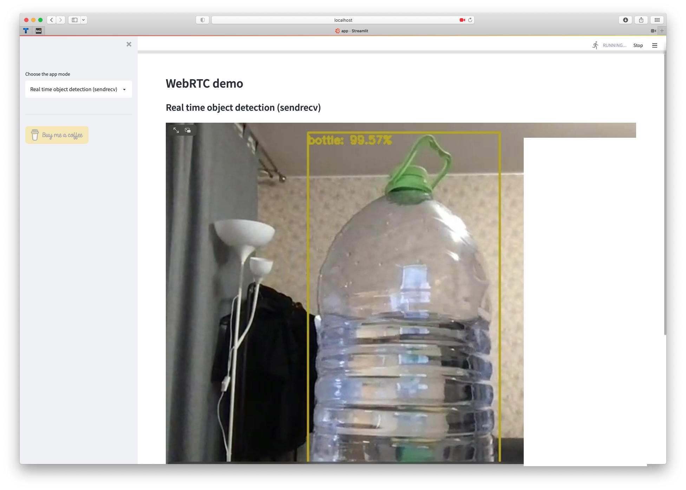
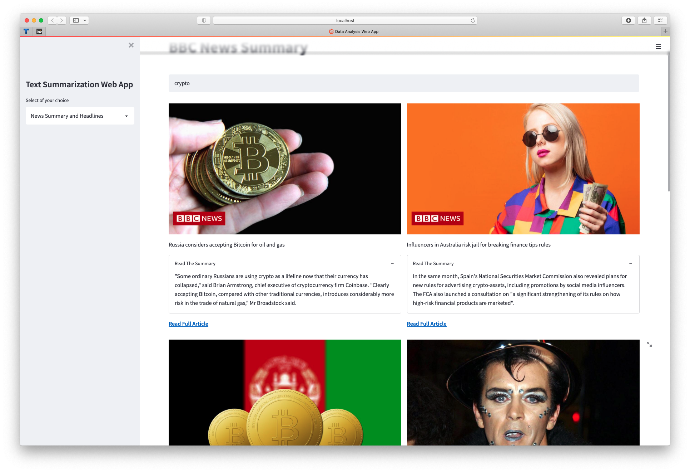
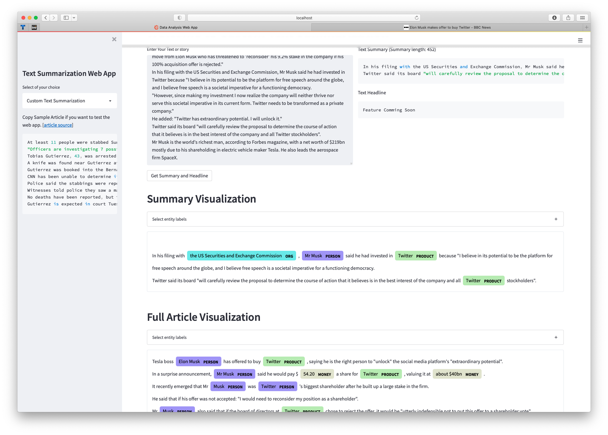
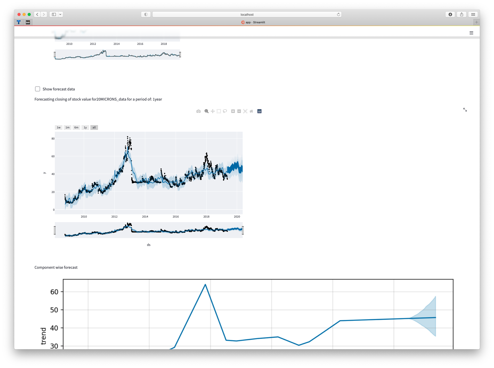
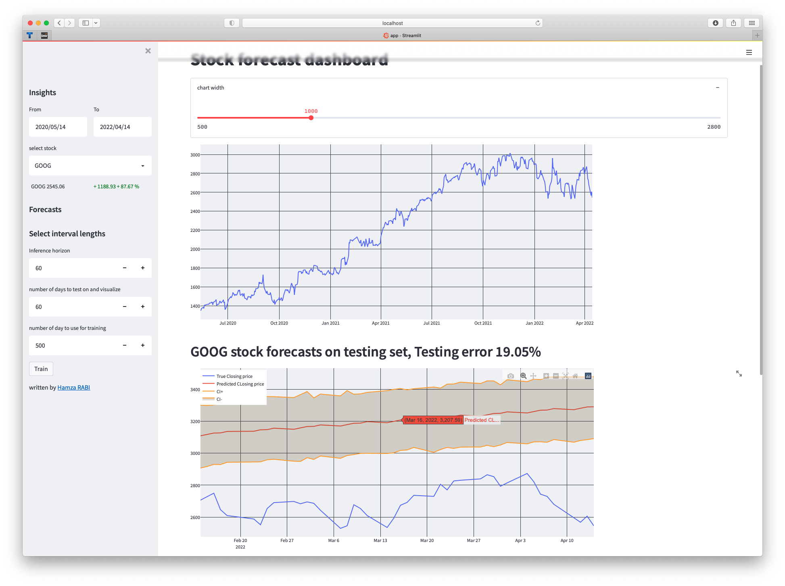

# EfficientDLStreamlitDemo

All projects start with `streamlit run app.py`

1. Webrtc-example 

2. Text-Summarization

|   s|     q |
|----| ---- |
|  |  |

4. TimeseriesForcastOne 

5. TimeseriesForecastTwo  

* Utacdeploy_